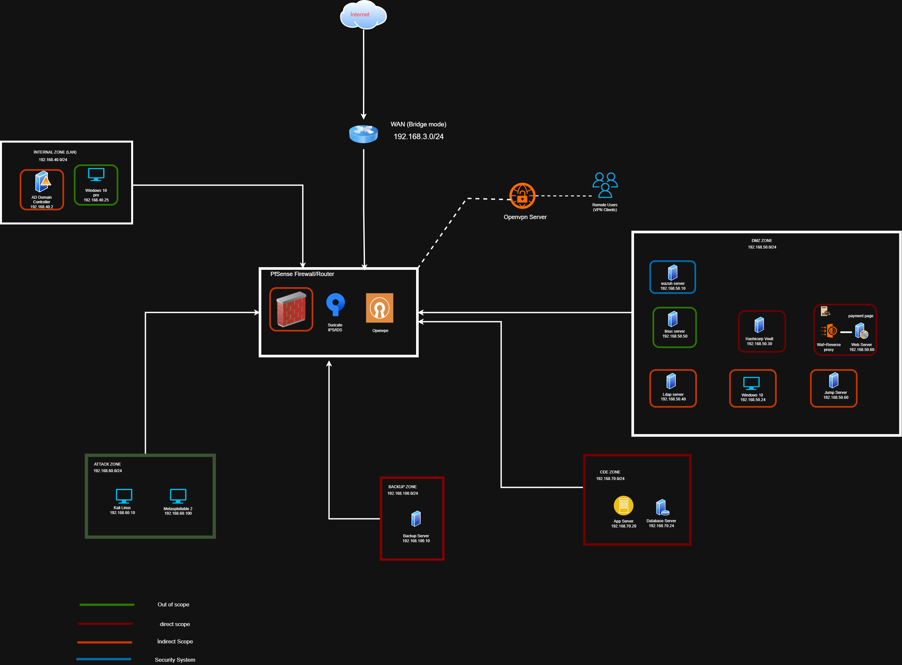
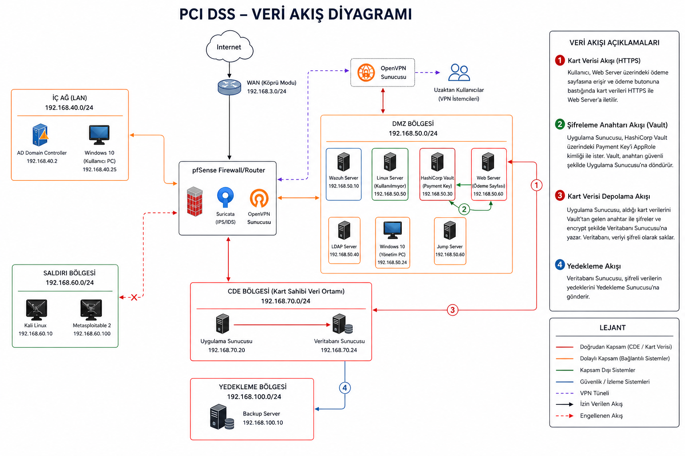
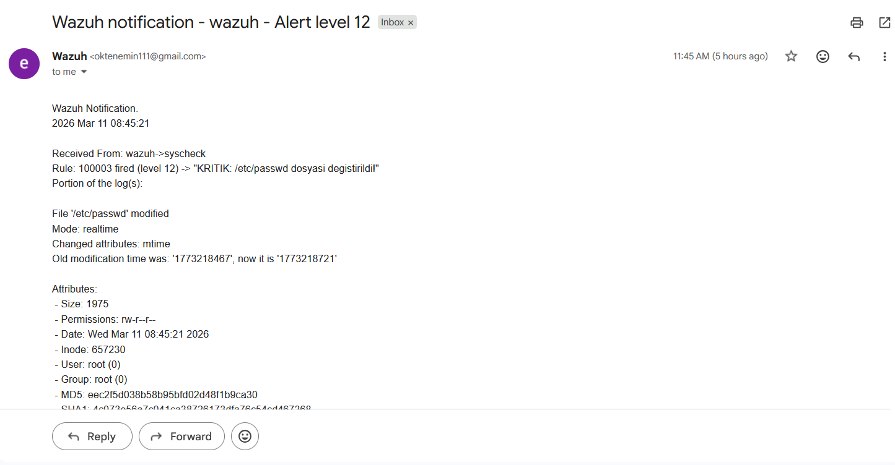
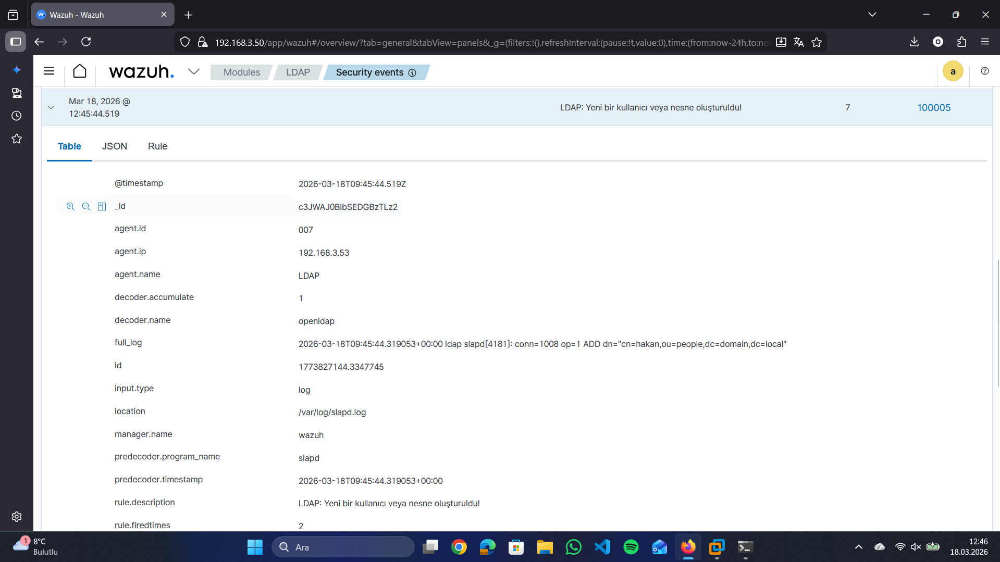
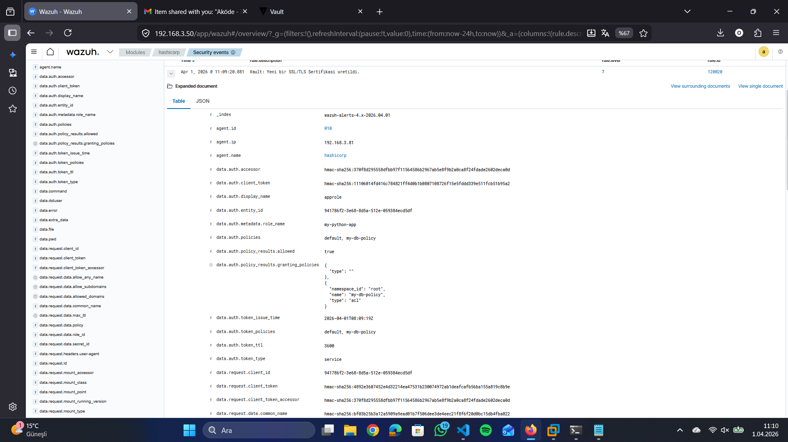
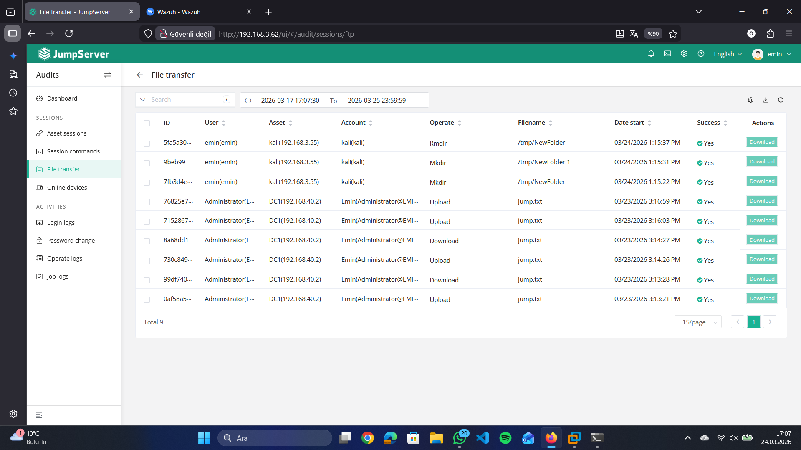

# PCI DSS v4.0.1 Security Lab

A realistic enterprise-style PCI DSS v4.0.1 laboratory environment designed to simulate a secure payment card infrastructure.

This project was built during my cybersecurity internship to gain hands-on experience with PCI DSS controls, network segmentation, secure payment processing, centralized monitoring, privileged access management, vulnerability validation, and evidence collection.

The objective was not only to deploy security technologies, but also to think like both an attacker and a SOC analyst by validating security controls through monitoring, detection, attack simulation, and compliance-oriented evidence gathering.

---

# Architecture Overview



The environment is divided into multiple security zones and protected through a centralized pfSense firewall.

### Security Zones

| Zone                              | Network          |
| --------------------------------- | ---------------- |
| Internal Zone                     | 192.168.40.0/24  |
| DMZ Zone                          | 192.168.50.0/24  |
| Attack Zone                       | 192.168.60.0/24  |
| Cardholder Data Environment (CDE) | 192.168.70.0/24  |
| Backup Zone                       | 192.168.100.0/24 |

### Key Security Controls

* pfSense Firewall
* Network Segmentation
* Default Deny Security Model
* Suricata IDS/IPS
* OpenVPN Remote Access
* Multi-Factor Authentication
* Wazuh SIEM
* HashiCorp Vault
* ModSecurity WAF

---

# Cardholder Data Flow



The payment workflow demonstrates how cardholder data is securely processed, encrypted, stored, and monitored.

### Transaction Flow

Customer

↓

Web Server (DMZ)

↓

Application Server (CDE)

↓

HashiCorp Vault

↓

Encrypted Database Storage

↓

Backup Server

### Security Controls

* CVV is never stored.
* PAN values are displayed in truncated format.
* Cardholder data is encrypted before storage.
* Encryption keys are managed through HashiCorp Vault.
* Application authenticates to Vault using AppRole.
* Database storage is protected using disk encryption.
* Administrative access requires MFA.

---

# Lab Environment

## Internal Zone

### Systems

* Active Directory Domain Controller
* Windows Server 2016
* Windows 10 Client

### Implemented Controls

* Group Policies
* Password Policies
* Account Lockout Policies
* Session Timeout Controls
* Centralized Authentication

---

## DMZ Zone

### Systems

* Wazuh SIEM
* HashiCorp Vault
* OpenLDAP
* Jump Server
* Web Server
* Linux Server
* Administrative Workstation

### Implemented Controls

* Reverse Proxy
* ModSecurity WAF
* Centralized Monitoring
* Secure Administrative Access

---

## Cardholder Data Environment (CDE)

### Systems

* Application Server
* Database Server

### Implemented Controls

* Network Isolation
* MFA Protected Administration
* Jump Server Access
* Disk Encryption
* Centralized Monitoring
* Encrypted Data Storage

---

## Attack Zone

### Systems

* Kali Linux
* Metasploitable 2

### Activities

* Vulnerability Validation
* Detection Testing
* Attack Simulation
* Security Control Verification

---

## Backup Zone

### Systems

* Backup Server

### Implemented Controls

* Segregated Backup Storage
* Automated Database Backups
* Recovery Validation
* Restricted Access

---

# Payment Security Architecture

The payment application was developed to simulate a PCI DSS-aligned payment workflow.

### Security Features

* Flask Application Architecture
* Dedicated Python Virtual Environment
* AppRole Authentication
* HashiCorp Vault Integration
* Encryption Before Storage
* Encrypted Database Records
* Disk-Level Encryption

### Sensitive Data Handling

| Data Type       | Storage Method    |
| --------------- | ----------------- |
| CVV             | Not Stored        |
| PAN             | Truncated Display |
| Card Data       | Encrypted         |
| Encryption Keys | HashiCorp Vault   |

---

# Monitoring & Detection

All systems are integrated with Wazuh SIEM for centralized monitoring.

### Monitored Security Events

* Authentication Failures
* LDAP Changes
* Root Activity
* Privilege Escalation
* Administrative Actions
* Malware Events
* WAF Events
* Vault Access Attempts
* File Integrity Monitoring (FIM)

---

# Detection Use Cases

## File Integrity Monitoring

Detection of unauthorized modifications to critical operating system files.

Examples:

* /etc/passwd
* /etc/shadow
* System configuration files



---

## LDAP Monitoring

Detection of:

* User Creation
* User Deletion
* Group Modifications
* Privilege Changes



---

## HashiCorp Vault Monitoring

Detection of:

* Unauthorized Access Attempts
* Failed Authentication Events
* Secret Access Activity
* Policy Violations



---

## Privileged Session Monitoring

Administrative activity monitored through Jump Server.

Detection Examples:

* Administrative Login
* File Transfers
* Session Activity
* Privileged Commands



---

# Endpoint Protection

### Linux Systems

* ClamAV
* Scheduled Malware Scans

### Windows Systems

* Microsoft Defender

### Monitoring

Security events are forwarded to Wazuh for centralized visibility.

---

# Vulnerability Validation

Nessus Professional was deployed inside the Attack Zone.

### Activities

* Credentialed Vulnerability Assessments
* Infrastructure Validation
* Security Control Verification
* Remediation Validation

### Assessment Targets

* Internal Zone
* DMZ Systems
* CDE Systems
* Infrastructure Components

---

# PCI DSS Requirement Coverage

| Requirement    | Status                |
| -------------- | --------------------- |
| Requirement 1  | Implemented           |
| Requirement 2  | Implemented           |
| Requirement 3  | Implemented           |
| Requirement 4  | Implemented           |
| Requirement 5  | Implemented           |
| Requirement 6  | Implemented           |
| Requirement 7  | Implemented           |
| Requirement 8  | Implemented           |
| Requirement 9  | Out of Scope          |
| Requirement 10 | Implemented           |
| Requirement 11 | Implemented           |
| Requirement 12 | Partially Implemented |

Detailed control mapping is available at:

```text
pci_dss_mapping/pci_controls.md
```

---

# Project Structure

```text
PCI-DSS-LAB
│
├── README.md
│
├── architecture
│   ├── lab_topology.png
│   └── data_flow_diagram.png
│
├── screenshots
│   ├── wazuh
│   ├── vault
│   ├── ldap
│   ├── jumpserver
│   └── payment_app
│
├── docs
│   ├── network_segmentation.md
│   ├── payment_workflow.md
│   └── monitoring_detection.md
│
└── pci_dss_mapping
    └── pci_controls.md
```

---

# Documentation

Additional technical documentation:

* Network Segmentation
* Payment Workflow
* Monitoring & Detection
* PCI DSS Control Mapping

---

# Technologies Used

### Security

* pfSense
* Suricata
* Wazuh
* OpenSearch
* HashiCorp Vault
* ModSecurity
* OpenVPN

### Identity & Access Management

* Active Directory
* OpenLDAP
* JumpServer
* MFA (OTP)

### Infrastructure

* Ubuntu Server
* Windows Server 2016
* Windows 10
* Kali Linux
* Metasploitable 2

### Application Stack

* Flask
* Nginx
* Python
* MySQL

### Endpoint Protection

* ClamAV
* Microsoft Defender

### Vulnerability Management

* Nessus Professional

---

# Disclaimer

This project was developed for educational, research, and defensive security purposes to demonstrate practical PCI DSS security concepts and implementation techniques within a controlled laboratory environment.
